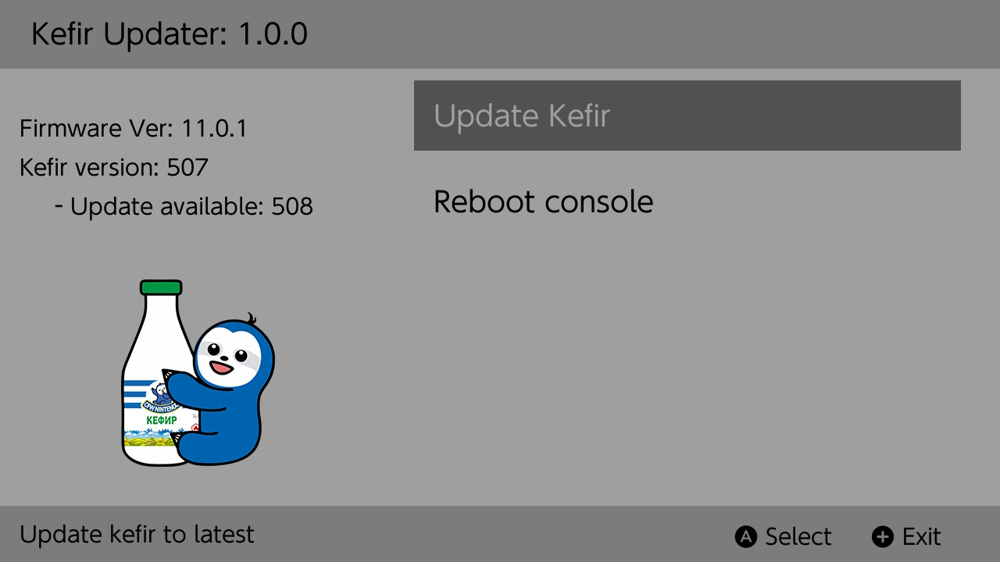
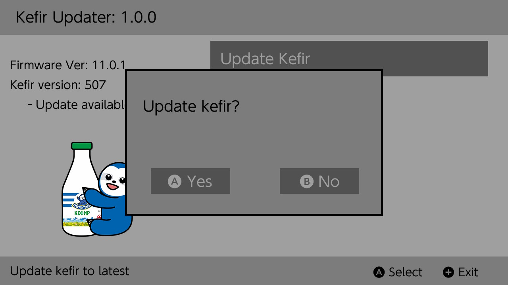
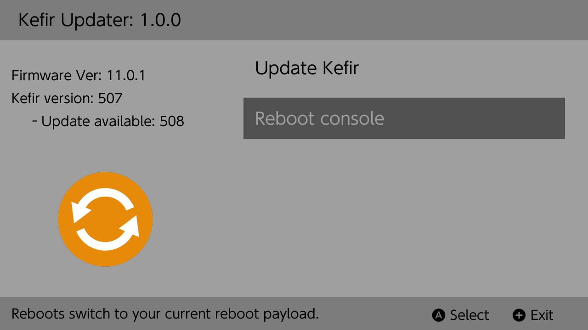

# Kefir Updater

Update [Kefir](https://github.com/rashevskyv/kefir/) directly from console



----

## Install

Download the latest release from [here](https://github.com/rashevskyv/kefirupdater/releases).
Move the downloaded `.nro` onto you Nintendo Switch SD Card inside the folder **/switch/kefirupdater/**.
That's it!

**Do not use with SD formatted to exFAT!!**

----

## Usage

**Update Kefir:**
* Downloads the latest [Kefir](https://github.com/rashevskyv/kefir/releases) release. 



**Reboot Console:**
* Reboots the switch, loading the payload from **/payload.bin** on erista or just reboot console on Mariko
* This is recommended after install Atmosphere.



----

## Features 

Приложение удаляет много файлов и папок с карты памяти, в точности копируя функционал скрипта установки, использующегося для автоматической установки Кефира из Windows. Благодаря этом шанс на ошибку после установки сильно снижен. Например, автоматически удаляется установленная тема, старые версии TESLA и прочее. Полный список удаляемого можно просмотреть ниже. Обратите внимание, что удаляются так же важные для работы системы папки и файлы, однако они заменяются своими свежими версиями сразу же во время распаковки кефира. 

```
	remove_entry("/atmosphere/exefs_patches");
    remove_entry("/atmosphere/kip_patches");
    remove_entry("/atmosphere/hekate_kips");
    remove_entry("/bootloader/debug");
    remove_entry("/modules");

    remove_entry("/atmosphere/contents/0100000000000032");
    remove_entry("/atmosphere/contents/0100000000000034");
    remove_entry("/atmosphere/contents/0100000000000037");
    remove_entry("/atmosphere/contents/0100000000000036");
    remove_entry("/atmosphere/contents/010000000000002b");
    remove_entry("/atmosphere/contents/010000000000000D");
    remove_entry("/atmosphere/contents/010000000000100D");
    remove_entry("/atmosphere/contents/4200000000000010");
    remove_entry("/atmosphere/contents/0100000000000008");
    remove_entry("/atmosphere/contents/690000000000000D");
    remove_entry("/atmosphere/contents/420000000000000E");
    remove_entry("/atmosphere/contents/010000000000100B");
    remove_entry("/atmosphere/contents/01FF415446660000");
    remove_entry("/atmosphere/contents/0100000000000352");
    remove_entry("/atmosphere/contents/00FF747765616BFF");
    remove_entry("/atmosphere/contents/00FF0012656180FF");
    remove_entry("/atmosphere/contents/0100000000001013");
    remove_entry("/atmosphere/contents/010000000007E51A");
    remove_entry("/atmosphere/contents/420000000007E51A");
    remove_entry("/atmosphere/contents/0100000000001000");
    remove_entry("/sxos/titles/");
    remove_entry("/sxos/bootloader");
    remove_entry("/sxos/switch");
    remove_entry("/sxos/exefs_patches");
    remove_entry("/sept");
    remove_entry("/switch/lithium");
    remove_entry("/switch/tinfoil");
    remove_entry("/switch/KosmosToolbox");
    remove_entry("/switch/KosmosUpdater");
    remove_entry("/switch/mercury");
    remove_entry("/switch/NX-Activity-Log/");
    remove_entry("/switch/ldnmitm_config");
    remove_entry("/switch/LinkUser/");
    remove_entry("/switch/nxmtp/");
    remove_entry("/switch/incognito");
    remove_entry("/switch/fakenews-injector");
    remove_entry("/switch/ChoiDujourNX");
    remove_entry("/pegascape");
    remove_entry("/sxos/sx");

    remove("/hbmenu.nro");
    remove("/install.bat");
    remove("/switch/checkpoint.nro");
    remove("/switch/checkpoint/checkpoint.nro");
    remove("/switch/pplay.nro");
    remove("/switch/NX-SHELL.nro");
    remove("/switch/kefirupdater/kefirupdater.nro");
    remove("/switch/reboot_to_payload.nro");
    remove("/switch/NxThemesInstaller.nro");
    remove("/switch/NxThemesInstaller/NxThemesInstaller.nro");
    remove("/switch/sx.nro");
    remove("/switch/n1dus.nro");
    remove("/switch/ChoiDujourNX.nro");
    remove("/switch/ChoiDujourNX/ChoiDujourNX.nro");
    remove("/switch/kefirupdater/kefirupdater.nro");
    remove("/switch/daybreak.nro");
    remove("/switch/daybreak/daybreak.nro");
    remove("/switch/nx-ntpc.nro");
    remove("/switch/dbi.nro");
    remove("/switch/dbi/dbi.nro");
    remove("/switch/nxmtp.nro");
    remove("/switch/NX-Activity-Log.nro");
    remove("/switch/incognito.nro");
    remove("/switch/ultimate_updater.nro");
    remove("/switch/zerotwoxci.nro");
    remove("/switch/dOPUS.nro");
    remove("/switch/tinfoil.nro");
    remove("/switch/tinfoil_batch.nro");
    remove("/switch/tinfoil_duckbill.nro");
    remove("/switch/tinfoil_usb-fix.nro");
    remove("/switch/ldnmitm_config.nro");
    remove("/switch/fakenews-injector.nro");
    remove("/switch/gag-order.nro");
    remove("/switch/tinfoil/keys.txt");
    remove("/switch/sx/locations.conf");
    remove("/switch/.overlays/emuiibo.ovl");

    remove("/atmosphere/fusee-secondary_atmo.bin");
    remove("/atmosphere/hbl_atmo.nsp");
    remove("/atmosphere/fusee-secondary.bin.sig");
    remove("/atmosphere/hbl.nsp.sig");
    remove("/atmosphere/hbl.json");
    remove("/atmosphere/BCT.ini");
    remove("/atmosphere/system_settings.ini");
    remove("/atmosphere/system_settings.ini");
    remove("/atmosphere/kips/fs_mitm.kip");
    remove("/atmosphere/kips/ldn_mitm.kip");
    remove("/atmosphere/kips/loader.kip");
    remove("/atmosphere/kips/pm.kip");
    remove("/atmosphere/kips/sm.kip");
    remove("/atmosphere/kips/ams_mitm.kip");
    remove("/atmosphere/flags/hbl_cal_read.flag");
    remove("/atmosphere/exosphere.bin");
    remove("/atmosphere/hbl.nsp");
    remove("/atmosphere/loader.ini");
    remove("/atmosphere/reboot_payload.bin");
    remove("/atmosphere/BCT.ini");
    remove("/atmosphere/fusee-secondary.bin");

    remove("/bootloader/payloads/fusee-primary-payload.bin");
    remove("/bootloader/payloads/Lockpick_RCM.bin");
    remove("/bootloader/payloads/biskeydump.bin");
    remove("/bootloader/payloads/fusee-payload.bin");
    remove("/bootloader/payloads/fusee-primary.bin");
    remove("/bootloader/payloads/sxos.bin");
    remove("/bootloader/payloads/rajnx_ipl.bin");
    remove("/bootloader/ini/Atmosphere.ini");
    remove("/bootloader/ini/atmosphere.ini");
    remove("/bootloader/ini/sxos.ini");
    remove("/bootloader/ini/hekate_keys.ini");
    remove("/bootloader/ini/RajNX.ini");
    remove("/bootloader/hekate_ipl.ini");
    remove("/bootloader/update.bin");
    remove("/bootloader/update.bin.sig");
    remove("/bootloader/patches_template.ini");
    remove("/bootloader/patches.ini");
    remove("/bootloader/bootlogo.bmp");
    remove("/bootloader/res/icon_payload.bmp");
    remove("/bootloader/res/icon_switch.bmp");
    remove("/bootloader/payloads/rajnx_ipl.bin");

    remove("/games/hbgShop_forwarder_classic.nsp");
    remove("/games/hbgShop_forwarder_dark_v3.nsp");
    remove("/license-request.dat");
    remove("/fusee-secondary.bin");
    remove("/sxos/boot.dat");
    remove("/boot.dat");
    remove("/hekate*.bin");
    remove("/keys.dat");
    remove("/BCT.ini");
    remove("/hekate_ipl.ini");
    remove("/exosphere.ini");
```

## Build

Install the devkitpro tool chain from [here](https://devkitpro.org/wiki/Getting_Started).

 Using pacman (installed with devkitpro) install the following libraries:
* [switch-ex-curl](https://www.github.com/eXhumer/switch-ex-curl/)
	* `sudo dkp-pacman -U https://github.com/eXhumer/switch-ex-curl/releases/download/v7.69.1-3/switch-ex-curl-7.69.1-3-any.pkg.tar.zst`
* switch-freetype
* switch-sdl2
* switch-sdl2_gfx
* switch-sdl2_image
* switch-sdl2_ttf
* switch-zlib

If you have any problems building, feel free to open an issue including any build errors.

----

## TODO

1. Download firmware 
1. Redisign
1. Refactoring

----

## Special Thanks!

* [ITotalJustice](https://github.com/ITotalJustice) for originally developing the app.
* [JackInTheShop](https://github.com/JackInTheShop) for fork that I forked.
* [eXhumer](https://github.com/eXhumer) for recently updating the app with libnx 3.2.0 support, notably adding sigpatches support and the BCT.ini prompt. 
* [toph](https://github.com/sudot0ph) for the design of the app icon, as well as the most icons used within the app!
* [Black Rabbit](https://github.com/BlackRabbit22) for the design of the plus and error icon (and the idea for this app)!
* [bandithedoge](https://github.com/bandithedoge) for the background!
* [KrankRival](https://github.com/KranKRival) for the initial sys / ams version pr (and for motivating me to work on touch controls)!
* [duckbill](https://github.com/duckbill007) for proper realloc realisation. 
* [developersu](https://github.com/developersu) for remove directory realisation.
